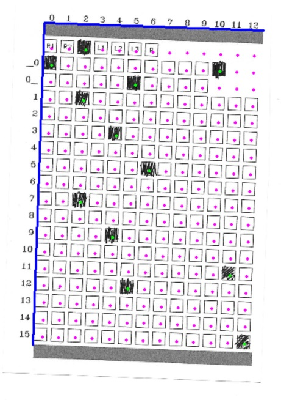

# ScantronScouter
Introducing ScantronScouter, the semi-paperless scouting method that only requires a single computer and flatbed scanner.

__Sample Screenshot__

## Installation
1. Install [Python 3.6](https://www.python.org/downloads/release/python-366/) (if not already installed)
1. Download a [zip file](https://github.com/arimb/ScantronScouter/archive/master.zip) of the repo from GitHub
2. Unzip
3. Configure the config.ini file in the text editor of your choice
4. Run ScantronScouter.exe
5. Enjoy!

## How It Works
1. Before the event starts:
    * Print a few lists of questions for the scouts to answer for each team in each match
    * Edit configuration file with file location settings and scouting question data
    * Print a lot of [scantron pages](scantron.png)
    * Cut each page into 4 scantron sheets
2. At the event:
    * Before each match, scouts enter team and match number by “bubbling in” their binary representations
    * During the match, scouts enter the answers to the questions by “bubbling in” the corresponding boxes
    * After the match, the lead scouter -
        * collects the scantron sheets
        * scans them onto the computer as images using the flatbed scanner
        * clicks "Add Data" in the [ScantronScouter program](ScantronScouter.exe)
        * selects the image of the latest scantron sheet
        * checks to make sure all of the dots over the "bubbled in" boxes are green and non-"bubbled in" boxes are purple (click to flip)
        * hits the enter button or space bar (any other key to exit without saving data)
    * Scouting data is sorted into either a single spreadsheet or individual spreadsheets per team
3. After the event:
    * To clear the scouting data, simply delete the spreadsheet file(s)
​

## [Configuration File](config.ini)
__Default Image Directory__

The relative or absolute path to the default folder containing the scantron images

__Data File__

Either a .csv file or a folder:

* If a file: the scouting data for all teams will be put here
* If a folder: a .csv file will be created for each team's scouting data in this folder

__Question #__

Name: the question's name

Type: the type of question being asked

* Single: records the highest number bubbled in (blank if empty)
* Multiple: records all of the numbers bubbles in (blank if empty)
* Binary: records the decimal number corresponding to the binary values bubbled in (0 if empty)
* TF: Records TRUE if 1 is bubbled in or FALSE if 0 is bubbled in (blank if empty)
* Enter a custom list of options, separated by commas: Lists all of the options who's corresponding boxes are bubbled in
